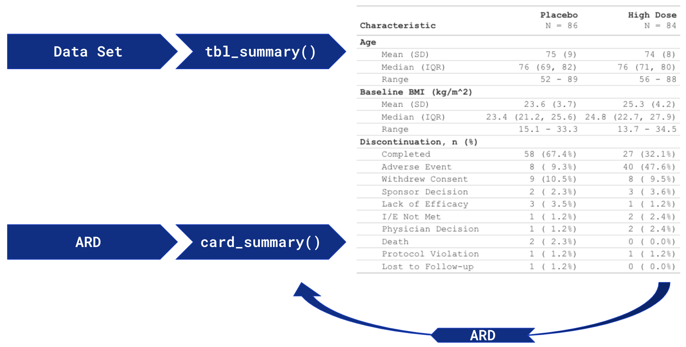
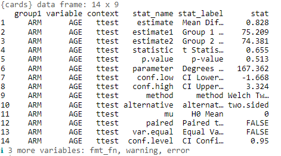

# cardx <a href="https://insightsengineering.github.io/cardx"></a>

<!-- badges: start -->

[](https://github.com/insightsengineering/cardx/actions/workflows/R-CMD-check.yaml)
[](https://app.codecov.io/gh/insightsengineering/cardx?branch=main)
[](https://lifecycle.r-lib.org/articles/stages.html#experimental)

<!-- badges: end -->

This is the source repository of the `cardx` R package.

The {cardx} package is an extension of the {cards} package, providing
additional functions to create Analysis Results Data Objects (ARDs)
using the **R** programming language. The {cardx} package exports ARD
functions that uses utility functions from {cards} and statistical
functions from additional packages (such as {stats}, {aod}, {car},
{survey}, etc.) to construct summary objects.

Summary objects can be used to:

-   [**Generate Tables and visualizations for Regulatory Submission**]
    easily in **R**. Perfect for presenting descriptive statistics,
    statistical analyses, regressions, etc. and more.

-   [**Conduct Quality Control checks on existing Tables** ] in R.
    Storing both the results and test parameters supports the re-use and
    verification of data analyses.

In the future, components of the {cards} package will be integrated
seamlessly with the {gtsummary} package for table creation. ARDs will be
a byproduct of {gtsummary} tables and ARDs will be acceptable input for
{gtsummary} functions as detailed in the image below:



## Installation

The latest development version of `{cardx}` can directly be installed
from GitHub by running the following:

``` r
if (!require("pak")) install.packages("pak")
pak::pak("insightsengineering/cardx")
```

## Examples

### Summary Table

Use
[`tbl_summary()`](https://www.danieldsjoberg.com/gtsummary/reference/tbl_summary.html)
to summarize a data frame.

Example ttest:

``` r
library(cardx)

# summarize the data with our package
cards::ADSL |> 
  # keep two treatment arms for the t-test calculation
  dplyr::filter(ARM %in% c("Placebo", "Xanomeline High Dose")) |> 
  cardx::ard_stats_t_test(by = ARM, variable = AGE)
```


